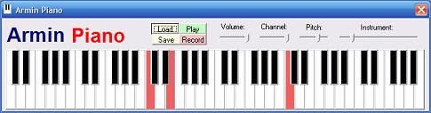



## Piano 2\.0

### Description

[Update May 2011] I decided to revamp this old submission with some new features such as selectable keyboard mapping, sustain via the shift key, playback timing should be a little better, and a few other things too... 

[Update Aug 2011] Minor changes + new demo songs 

This is a major update on Armin Niki's very nice MIDI polyphonic "Piano" submission CodeId=64928. New are selectable instruments and improved record and playback and keys displayed as they are played. Most of the original code has been revamped, but I'm sure there is still room for improvement. Armin approved of the changes and I was hoping that he would update his submission, but since he has not I am making this one.
 
### More Info
 

             |
---                |---
**Submitted On**   |2011-08-28 07:33:42
**By**             |[Paul Bahlawan](https://github.com/Planet-Source-Code/PSCIndex/blob/master/ByAuthor/paul-bahlawan.md)
**Level**          |Intermediate
**User Rating**    |5.0 (40 globes from 8 users)
**Compatibility**  |VB 5\.0, VB 6\.0
**Category**       |[Sound/MP3](https://github.com/Planet-Source-Code/PSCIndex/blob/master/ByCategory/sound-mp3__1-45.md)
**World**          |[Visual Basic](https://github.com/Planet-Source-Code/PSCIndex/blob/master/ByWorld/visual-basic.md)
**Archive File**   |[Piano\_2\_02210228282011\.zip](https://github.com/Planet-Source-Code/paul-bahlawan-piano-2-0__1-65486/archive/master.zip)

